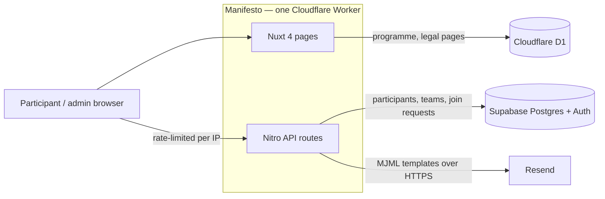

<p align="center">
  <picture>
    <source media="(prefers-color-scheme: dark)" srcset="https://raw.githubusercontent.com/LiberHack/.github/main/profile/assets/liberhack-ascii-dark.png">
    
  </picture>
</p>

# LiberHack — a 48-hour civic-tech hackathon in Burgas

Young people aged 14 to 25 spend a weekend building tools that expose what is broken in Bulgarian public services, using real data and real government sites. They register on this site, form teams, follow the programme on a live screen in the room, and pitch to a jury on Sunday afternoon.

**LiberHack 2026, Burgas** · 5 to 7 June 2026 · two organisers, Telerik Academy as partner · 44 participants in 15 teams · web

<p align="center">
  
</p>

## What it does

- **Participants** pick one of three tracks, or bring their own idea in the same spirit: an open-source design system for Bulgarian state websites, a tool that makes hidden public data impossible to ignore, or a secure platform for anonymous whistle-blowing. Teams of two to six work on site for 48 hours, from Friday afternoon to Sunday noon.
- **The jury** scores every project on a published rubric: technical craft and security (30%), radical critical thinking (30%), design and accessibility (20%), presentation and roast (20%). The top three teams take the main prizes and the best project in each track takes its own.
- **The organisers** run registration, team formation and the room from one site: participants sign up with their skills, create a team or ask to join one, and the live screen shows the countdown, schedule and announcements that admins edit during the event.

## Architecture

One Nuxt application, rendered and served by a single Cloudflare Worker, with Supabase as database and auth and Resend for email. There are no services, no queue and no cluster, because a registration site for a hundred people has one write path and a few hundred visitors a day.



Why it is shaped this way:

- **A small stack that needed no operator during the event.** The other platforms in this series run on Kubernetes with workers and queues. Here, anything that could page an organiser while they were on the floor for 48 hours was a liability, so the product got exactly what it needed and nothing to babysit. The first edition ran as one container behind Caddy with a self-hosted Supabase on a single VPS; after the event that server was removed entirely and the site moved to Cloudflare Workers and Supabase Cloud, so the second edition has no machine to look after.
- **Supabase as the participant database, with the rules in Postgres.** Row-level security separates participants from admins. Team size (two to six), the registration cap and the limit on custom skills are enforced by triggers, and invite codes are generated and rotated in SQL, so no client and no API route can put the data into an invalid state.
- **Team formation through validated forms.** Registration and team creation are validated three times: in the browser with zod schemas, again in the API route, and finally by the database constraints above, so a bad request fails early and a crafted one still cannot get through. A team leader approves or rejects requests from the dashboard, or shares an invite link whose code can be rotated if it leaks. Invite and skill endpoints carry their own stricter rate limits.
- **Transactional email from MJML templates.** Verification, magic link, password reset, join request, decision and event reminder emails are written in MJML, compiled to HTML and inlined into the bundle, so the Worker reads no files at runtime. Supabase Auth sends the same templates for its own emails.

## Screenshots

| | |
|---|---|
|  Participants at the Saturday coffee break |  Registration with skill picker, experience level and consent (staging, sample data) |
|  Participant dashboard: profile, team, wanted skills and invite link |  Join request email sent to the team leader |
|  Admin panel: participant list and CSV export (names and emails blurred) |  Opening on Friday with the partner and sponsors |

## Repositories

| Repository | What it is | Stack |
|---|---|---|
| [Manifesto](https://github.com/LiberHack/Manifesto) | Event site, registration, team formation, admin panel and live screen | Nuxt 4, Vue 3, Tailwind CSS 4, Supabase, Cloudflare Workers, D1, Resend, MJML |
| presentation (private) | Sponsorship deck for the second edition | Vite, React |

## Run it locally

```bash
git clone https://github.com/LiberHack/Manifesto && cd Manifesto && bun install
cp .env.example .env            # needs a Supabase project (URL, publishable and secret keys) and a Resend key
bun run dev
```

The public pages work without a Supabase project; registration, teams and the admin panel need one. The live site is at [liberhack.org](https://liberhack.org).

## By the numbers

| | |
|---|---|
| Participants | 44 |
| Teams | 15 |
| Hours on site | 48 |
| Tracks | 3 |
| Sponsors | 8, plus 2 partners |
| Prize fund | €1,200 |

## Team

- **Kirill Ibragimov** ([HexChap](https://github.com/HexChap)) — co-founder and co-organiser; wrote the regulations and judging rubric, secured sponsors, coordinated with Telerik Academy, and built most of the platform (registration, teams, admin, email, deployment).
- **[simeonnv](https://github.com/simeonnv)** — co-founder and co-organiser; built the landing page and part of the initial scaffolding of the platform.

Part of a series of platforms; the CV and the rest of the work are at [github.com/HexChap](https://github.com/HexChap).
